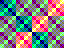

  

# Tiny Shader

Modern GPUs use fragment shaders to 

Meaning for each pixel a small program is executed to determine the final color.

## Examples

|Image|Shader|
|-|-|
|| <pre>GETX R0 GETY R1 XOR R0 R1 SETRGB R0 NOP NOP NOP NOP NOP NOP NOP NOP</pre> |
|||

## Architecture

Tiny Shader has four (mostly) general purpose registers, REG0 to REG4. REG0 is special in a way as it is the target or destination register for some instructions. All registers are 6 bit wide.

### Input

The shader has four sources to get input from:

- `X` - X position of the current pixel
- `Y` - Y position of the current pixel
- `TIME` - Increases with the frame number.
- `USER` - Value that can be set via the SPI interface.

### Output

The goal of the shader is to determine the final output color:

- `RGB` - The output color for the current pixel. Channel R, G and B can be set individually.

### Sine Look Up Table

TODO

## Instructions

The following instructions are supported by Tiny Shader. A program consists of 12 (TODO) instructions and is executed for each pixel individually. The actual resolution is therefore less than the VGA resolution.

### Output
|Instruction|Operation|Description|
|-----------|---------|-----------|
|SETRGB REGA|RGB <= REG|Set the output color to the value of the specified register.|
|SETR REGA|R <= REG[1:0]|Set the red channel of the output color to the lower two bits of the specified register.|
|SETG REGA|G <= REG[1:0]|Set the green channel of the output color to the lower two bits of the specified register.|
|SETB REGA|B <= REG[1:0]|Set the blue channel of the output color to the lower two bits of the specified register.|
### Input
|Instruction|Operation|Description|
|-----------|---------|-----------|
|GETX REGA|REG <= X|Set the specified register to the x position of the current pixel.|
|GETY REGA|REG <= Y|Set the specified register to the y position of the current pixel.|
|GETTIME REGA|REG <= TIME|Set the specified register to the current time value, increases with each frame.|
|GETUSER REGA|REG <= USER|Set the specified register to the user value, can be set via the SPI interface.|
### Branches
|Instruction|Operation|Description|
|-----------|---------|-----------|
|IFEQ REGA|TAKE <= REG == REG0|Execute the next instruction if REG equals REG0.|
|IFNE REGA|TAKE <= REG != REG0|Execute the next instruction if REG does not equal REG0.|
|IFGE REGA|TAKE <= REG >= REG0|Execute the next instruction if REG is greater then or equal REG0.|
|IFLT REGA|TAKE <= REG < REG0|Execute the next instruction if REG is less than REG0.|
### TODO
|Instruction|Operation|Description|
|-----------|---------|-----------|
|TODO0 REGA|TODO|TODO.|
|TODO1 REGA|TODO|TODO.|
|TODO2 REGA|TODO|TODO.|
### Special
|Instruction|Operation|Description|
|-----------|---------|-----------|
|SINE REGA|REG <= SINE[REG0[5:2]]|Get the sine value for REG0 and write into REG.|
### Boolean
|Instruction|Operation|Description|
|-----------|---------|-----------|
|AND REGA, REGB|REGA <= REGA & REGB|Boolean AND of REGA and REGB, result written into REGA.|
|OR REGA, REGB|REGA <= REGA | REGB|Boolean OR of REGA and REGB, result written into REGA.|
|NOT REGA, REGB|REGA <= ~REGB|Boolean NOT of REGB, result written into REGA.|
|XOR REGA, REGB|REGA <= REGA ^ REGB|Boolean XOR of REGA and REGB, result written into REGA.|
### Move
|Instruction|Operation|Description|
|-----------|---------|-----------|
|MOV REGA, REGB|REGA <= REGB|Move value of REGB into REGA.|
### Arithmetic
|Instruction|Operation|Description|
|-----------|---------|-----------|
|ADD REGA, REGB|REGA <= REGA + REGB|Add REGA and REGB, result written into REGA.|
### Shift
|Instruction|Operation|Description|
|-----------|---------|-----------|
|SHIFTL REGA, REGB|REGA <= REGA << REGB|Shift REGA with REGB to the left, result written into REGA.|
|SHIFTR REGA, REGB|REGA <= REGA >> REGB|Shift REGA with REGB to the right, result written into REGA.|
### Load
|Instruction|Operation|Description|
|-----------|---------|-----------|
|LDI IMMEDIATE|REGA <= IMMEDIATE|Load an immediate value into REGA.|

## Tiny Tapeout

This project was designed for [Tiny Tapeout](https://tinytapeout.com).
